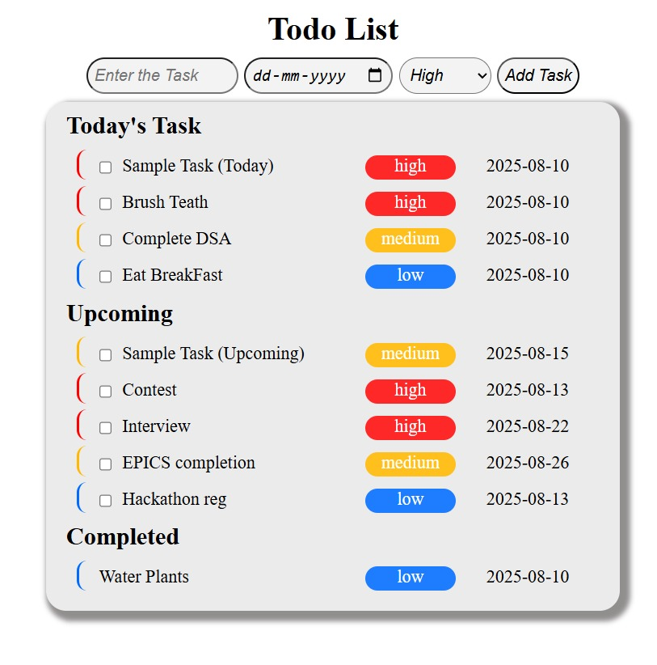

# React To-Do List

A simple and clean to-do list application built with React. This project demonstrates core React concepts like state management with `useState`, handling user input, and rendering lists of components.

## Features

- **Create Tasks:** Quickly add new items to your to-do list.
- **Smart Categorization:** Tasks are automatically organized into views for **Today**, **Upcoming**, and **Completed**.
- **One-Click Completion:** Simply check the box on a task to mark it as done and move it to the "Completed" section.
- **Persistent State:** Your tasks are saved in local storage, so your list is always waiting for you.



## How to Run

1.  **Clone the repository:**
    ```
    git clone https://github.com/your-username/your-repo-name.git
    ```
2.  **Install dependencies:**
    ```
    npm install
    ```
3.  **Start the development server:**
    ```
    npm run dev
    ```
